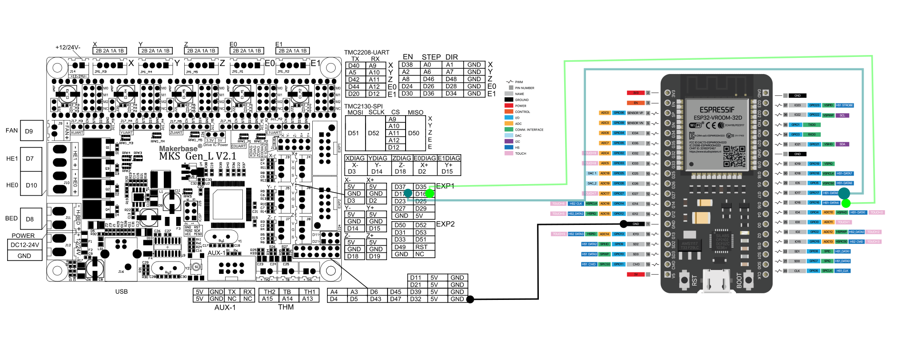

# espbraille
ESP32 Firmware for BrailleRAP WIFI extension with MKS GEN / L

## wiring
Simply wire ESP32 UART to MKS GEN-L UART

## building
You will need ESP32-IDF 5.1

## configure
You can configure project option with

>idf.py menuconfig

## building firmware

>idf.py build

## flash firmware

>idf.py flash

